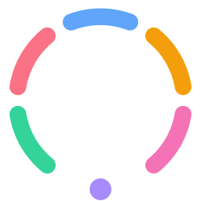
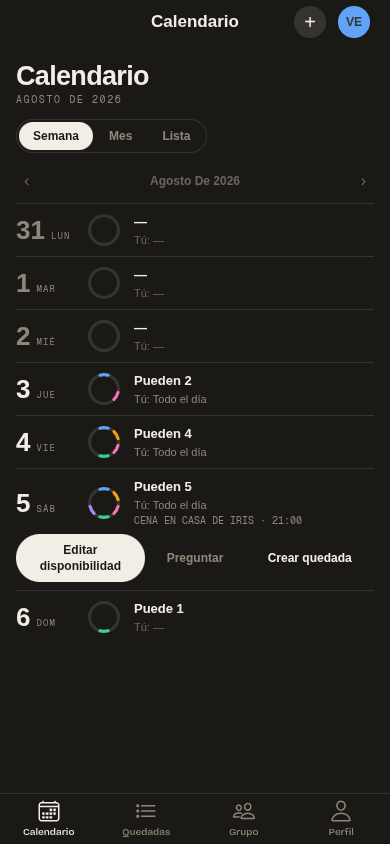
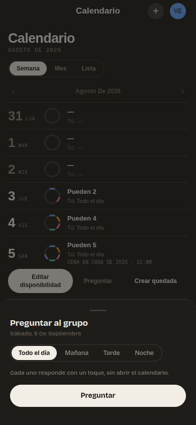
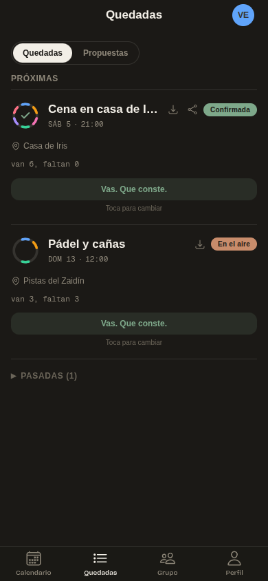
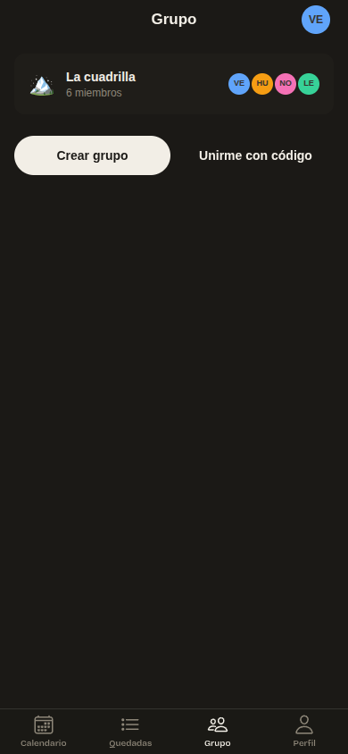
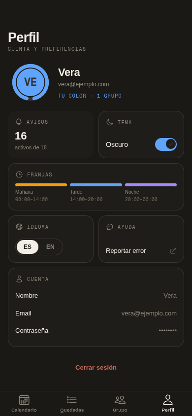
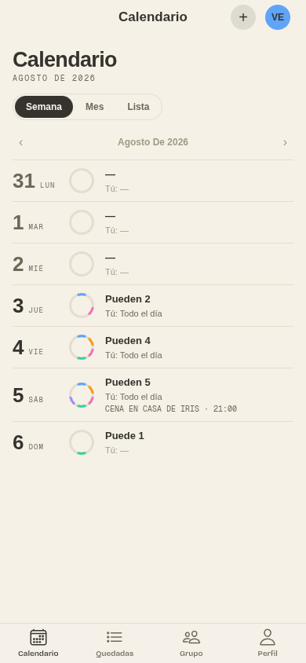

*[Español](README.md) · **English***



# ¿Quedamos?

**Your friends want to meet up. Nobody knows when.**

Quedamos asks the question and tells you when everyone can make it. A shared calendar for your crew, with no more screens than it needs.

[](https://quedamos.alvarotc.com)

[](https://github.com/alvarotorresc/quedamos-app/actions/workflows/ci.yml)
[](https://github.com/alvarotorresc/quedamos-app/releases/latest)
[](./LICENSE)


Version 1.0.0 · Web and Android · Free, no ads, code under MIT

## Open or install

- **Web**: [quedamos.alvarotc.com](https://quedamos.alvarotc.com). Works in any browser, phone or desktop.
- **Android**: [download the APK from the latest release](https://github.com/alvarotorresc/quedamos-app/releases/latest). Android will warn that it comes from outside Google Play; that's expected, not something specific to Quedamos. Open the file, allow the install if asked, and tap **Install**. The Android build adds push notifications and home-screen widgets.

An email is all it takes to create an account. A group is one tap, shared with a link.

## What it does

Meeting up with six people is a message thread nobody wants to read. Quedamos replaces it with three steps.

1. **Ask.** Someone asks about a day from the calendar: "Can you do Saturday night?". Everyone answers with one tap: yes, no, not sure yet.
2. **The ring closes.** Each person is an arc of one colour on a circle. The gap is whoever hasn't answered. When the ring closes, everyone can make it and you all get the notification. Zero taps, zero calendar to read.
3. **Let's meet.** Someone proposes a plan, a time and a place. Confirming closes your arc. The plan is sealed and lands in everyone's calendar.

And for when you need more:

- **Availability your way** — a whole day, morning, afternoon or evening slots with the hours you define, or an exact time range. Week, month and list views, with the best day worked out for you.
- **Proposals** — "A weekend in the Alpujarra?" gets voted up or down and, if it passes, becomes a plan with one tap.
- **Real plans** — a place that opens the map, a meeting link if it's online, a download for your calendar and a card you can share anywhere.
- **Alerts worth having** — a new plan, the ring closing, a reminder 24 hours before, who's not coming. Every type switches off on its own.
- **Android widgets** — the week and the best day on your home screen, without opening the app.
- **Six colours. Yours is yours.** Every member has a colour in the group and carries it everywhere: the ring, the plans, their profile.

## How it looks

The week view, with a ring per day and the actions for the selected day:



| Ask the group | Plans | Group |
|---|---|---|
|  |  |  |

<details>
<summary>More screens</summary>
<br>

| Profile | Light theme |
|---|---|
|  |  |

</details>

_Screenshots show the Spanish build with sample data. The app is fully translated into English and has dark and light themes._

## What Quedamos will never do

A feature list changes whenever it's convenient. This doesn't: it's the shape of the app.

- **Never** interrogate you. One question a day, at most. If there's nothing, it stays quiet.
- **Never** confetti. The celebration is the ring closing.
- **Never** streaks or points. No levels, no guilt for staying in.
- **Never** punish absence. Whoever hasn't answered is a gap, not a fault.
- **Never** shouty emoji. The voice is dry and direct. It only affirms when it's true.
- **Never** an AI in your plan. Your plan is yours.

<details>
<summary><strong>Technical details</strong></summary>

### Inside

| | |
|---|---|
| **1,400** | tests run on every change: 608 in the API and 792 in the app |
| **2** | languages, Spanish and English, full interface |
| **2** | themes, dark and light |
| **100%** | of the code under MIT |

### How it's built

A monorepo with two applications. The app is a web app that Capacitor packages for Android; the API is a NestJS service. Supabase provides the database, authentication and real-time sync; Firebase Cloud Messaging, the push notifications.

| | |
|---|---|
| App | React 18 · Ionic 8 · Capacitor 7 · Tailwind 3 · Vite 6 · Vitest |
| Android widgets | Kotlin · RemoteViews · WorkManager |
| API | NestJS 10 · Prisma 6 · PostgreSQL · Jest |
| Platform | Supabase (Postgres, Auth, Realtime) · Firebase Cloud Messaging |
| External data | Open-Meteo for weather · Nominatim for place search |
| Deployment | Web on Vercel · API in Docker behind Caddy · CI on GitHub Actions |
| Android | minimum Android 6.0 (API 23) · target Android 15 (API 35) |

### Run it locally

Requirements: Node 20 or later and pnpm 9.

```bash
git clone https://github.com/alvarotorresc/quedamos-app.git
cd quedamos-app
pnpm install
```

Copy `apps/api/.env.example` and `apps/mobile/.env.example` to `.env` and fill in the keys of your Supabase and Firebase projects.

```bash
pnpm --filter @quedamos/api dev       # API at http://localhost:3000
pnpm --filter @quedamos/mobile dev    # app at http://localhost:5173
```

Tests, lint and types, per application:

```bash
pnpm --filter @quedamos/api exec jest
pnpm --filter @quedamos/mobile exec vitest run
pnpm lint && pnpm typecheck
```

Mind `pnpm build` in `apps/api`: besides compiling, it applies the Prisma migrations to the database in `DATABASE_URL`. Use a throwaway database when working on migrations.

### Android

You need Android Studio with SDK 35 and your Firebase project's `google-services.json` in `apps/mobile/android/app/` (it's git-ignored and the build refuses to continue without it).

```bash
cd apps/mobile
pnpm build && pnpm cap:sync     # builds the web app and copies it into the Android project
pnpm cap:android                # opens Android Studio
```

### Layout

```
apps/api       NestJS: auth, groups, availability, plans, proposals, questions, notifications, widget
apps/mobile    React + Ionic: pages, components, design system in src/ui, i18n in src/i18n
packages/shared  types shared by both
```

</details>

## License

[MIT](./LICENSE), all of the code. Do what you want with it; if you ship it under another name, all the better for everyone.

---

¿Quedamos? · free software under MIT · [Web](https://quedamos.alvarotc.com) · [Code](https://github.com/alvarotorresc/quedamos-app) · [License](./LICENSE) · [Report a bug](https://tally.so/r/ODMzOa)
